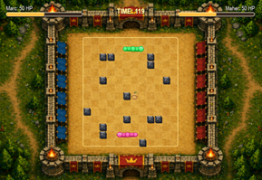
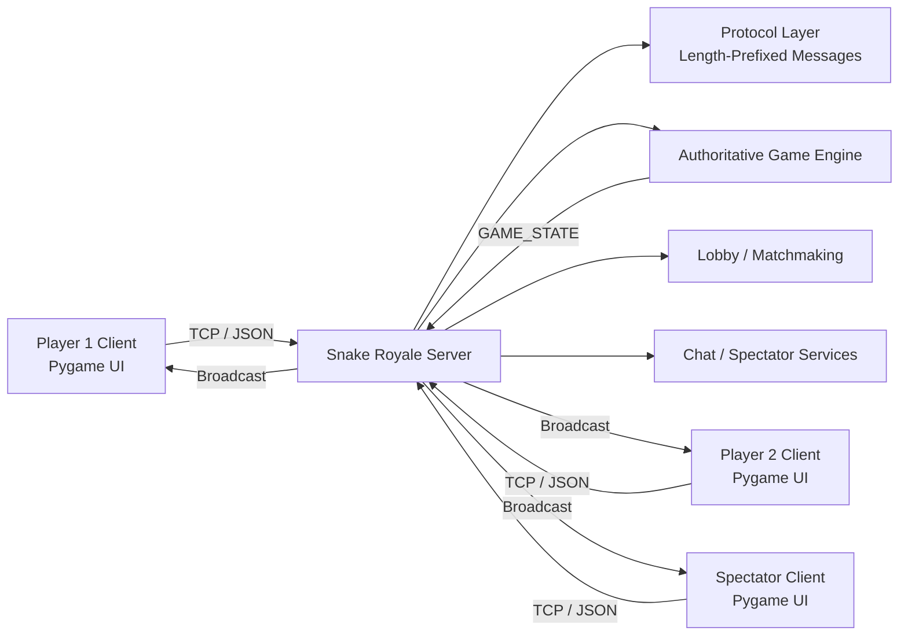
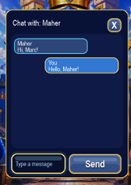
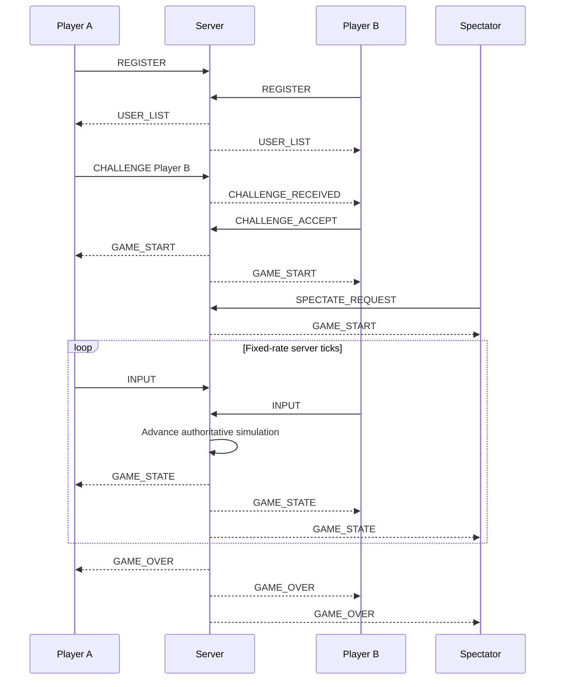

# 🐍 Snake Royale

**A real-time multiplayer Snake game built from the ground up with Python, Pygame, TCP sockets, multithreading, and a custom application-layer protocol.**

Snake Royale transforms the classic Snake game into a networked 1v1 multiplayer experience with live matchmaking, synchronized gameplay, spectators, private chat, player customization, and server-authoritative game logic.

The project explores the engineering behind real-time networked applications: **TCP message framing, concurrent connections, state synchronization, client-server architecture, game-loop design, and failure handling.**

<p align="center">
  
</p>

---

## ✨ Features

### 🎮 Real-Time Multiplayer

* Competitive **1v1 Snake matches**
* Server-authoritative game simulation
* Fixed-rate game loop for synchronized state updates
* Five-second pre-match countdown
* Health-based collision system
* Timed matches with automatic winner/draw resolution

### 🌐 Multiplayer Lobby

* Live list of connected players
* Player availability states
* Direct player challenges
* Challenge acceptance and rejection
* Automatic lobby updates when player state changes

### 👀 Spectator System

* Connected users can spectate the active match
* Spectators receive the same live game-state updates as players
* Join and leave spectating without interrupting the match
* Spectator cheering system with temporary in-game messages

### 💬 Private Chat

* Direct messaging between connected users
* Per-user conversation history
* Unread-message counters
* Temporary chat notifications
* Server-side message validation and length limiting

### 🎨 Customization

* Player-selectable snake colors
* Customization synchronized through the server
* Color changes reflected in the lobby and active game state

### 👑 Power-Up Mechanics

* Regular food restores health
* Special power pies appear periodically
* Collecting a power pie grants a temporary crown advantage
* Crown status changes player-collision behavior
* Power-ups spawn only on unoccupied tiles

---

## 🏗️ Architecture

Snake Royale uses a **TCP client-server architecture** in which the server owns the canonical game state.



Clients are responsible for **input and presentation**. The server is responsible for **validation, simulation, matchmaking, and game-state ownership**.

A player therefore does not directly update their snake's position. Instead:

1. The client captures a directional input.
2. An `INPUT` message is sent over TCP.
3. The server validates and stores the requested direction.
4. The authoritative game loop advances the simulation.
5. The resulting game state is serialized.
6. The server broadcasts the new state to both players and spectators.
7. Each client renders the state locally.

This keeps every connected client synchronized around a single source of truth.

---

## 🔌 Custom TCP Protocol

TCP provides a reliable byte stream, but it does **not preserve application message boundaries**.

Snake Royale therefore implements its own message-framing protocol instead of assuming that one call to `recv()` corresponds to one complete message.

Each message is structured as:

```text
┌──────────────────────┬─────────────────────────────┐
│ 4-byte length header │ UTF-8 JSON message          │
│ Network byte order   │ {"type": ..., "payload":...}│
└──────────────────────┴─────────────────────────────┘
```

The sender:

1. Serializes the message to JSON.
2. Encodes it as UTF-8.
3. Calculates the payload length.
4. Packs that length into a **4-byte unsigned integer in network byte order**.
5. Sends the header and payload together.

The receiver first reads exactly four bytes to determine the message length, then continues reading until the full payload has arrived.

This handles cases where TCP splits a logical application message across multiple socket reads.

Example:

```json
{
  "type": "INPUT",
  "payload": {
    "direction": "UP"
  }
}
```

### Protocol Message Types

```text
REGISTER
REGISTER_OK
REGISTER_FAIL

USER_LIST

CHALLENGE
CHALLENGE_RECEIVED
CHALLENGE_ACCEPT
CHALLENGE_REJECT

GAME_START
INPUT
GAME_STATE
GAME_OVER

SPECTATE_REQUEST
LEAVE_SPECTATE
CHEER

CHAT_SEND
CHAT_MESSAGE

CUSTOMIZATION_UPDATE

INFO
ERROR
```

Keeping protocol definitions separate from the rest of the application makes the networking layer easier to reason about and extend.

---

## ⚙️ Server Design

The server manages:

* TCP connections
* User registration
* Online-player state
* Matchmaking
* Player customization
* Chat routing
* Spectator membership
* Player inputs
* Game simulation
* State broadcasts
* Client disconnections

### Concurrent Connections

Each accepted TCP connection is handled by its own daemon thread:

```text
                    ┌── Client Handler Thread ── Player A
TCP Server ─────────┼── Client Handler Thread ── Player B
                    ├── Client Handler Thread ── Spectator A
                    └── Client Handler Thread ── Spectator B
```

Shared server state is protected with a `threading.Lock`, including:

* connected clients
* usernames
* player statuses
* customization data
* pending challenges
* active-match state

The active match runs on a separate game-loop thread.

---

## ⏱️ Authoritative Game Loop

The simulation runs at a fixed:

```text
5 ticks / second
```

At every tick, the server:

```text
Player inputs
     ↓
Validate directions
     ↓
Calculate next snake positions
     ↓
Resolve simultaneous movement
     ↓
Detect collisions
     ↓
Apply damage / rollback if needed
     ↓
Process food and power-ups
     ↓
Update timer and win conditions
     ↓
Serialize authoritative state
     ↓
Broadcast GAME_STATE
```

The client renders independently at a higher frame rate, while gameplay outcomes remain controlled by the server.

---

## 💥 Collision System

Snake Royale uses a health-based collision model rather than traditional instant-death Snake.

The engine distinguishes between:

* board boundaries
* obstacles
* self-collisions
* collisions with the opponent
* simultaneous head-to-head collisions

For recoverable collisions, the server stores each snake's **last safe body state**.

```text
Invalid next position
        ↓
Restore last safe body
        ↓
Apply collision damage
        ↓
Continue match if health > 0
```

This prevents the game state from being left in an invalid position while still supporting health-based gameplay.

Both snakes' next positions are calculated before either movement is committed, allowing simultaneous interactions to be resolved consistently.

---

## 👑 Power-Pie Mechanic

After a configured number of normal pies, the game spawns a special **power pie**.

Collecting it grants the player a temporary crown advantage.

<p align="center">
  
</p>

While crowned, the snake receives an advantage during player collisions. The effect expires after additional pies have been consumed.

Power-up and food spawning checks the current board state and selects only unoccupied locations, avoiding:

* snakes
* obstacles
* existing food

---

## 🖥️ Client Architecture

The Pygame client separates networking from rendering and interface logic.

```text
                     ┌─ Connect Screen
                     ├─ Username Screen
                     ├─ Lobby Screen
Pygame Client ───────┼─ Customization
                     ├─ Game Screen
                     └─ Result Screen

                            ↕
                     Screen Manager

                            ↕
                       Client State

                            ↕
                     Network Client

                            ↕
                       TCP Server
```

The network client maintains a background receive thread so blocking socket reads do not freeze the Pygame interface.

Incoming network messages are placed into a queue and processed by the main client loop, keeping network I/O separate from UI rendering and event handling.

---

## 💬 Player Communication

Snake Royale also includes direct communication between connected users.

<p align="center">
  
</p>

The chat system supports:

* direct player-to-player messaging
* conversation history
* unread-message tracking
* temporary notifications
* server-side message routing and validation

This communication uses the same application protocol as gameplay and matchmaking events.

---

## 🔄 Example Match Flow



---

## 🛡️ Connection & Failure Handling

The networking layer includes safeguards for real-world socket behavior:

* `TCP_NODELAY` minimizes latency from TCP's Nagle algorithm
* `SO_KEEPALIVE` helps detect broken connections
* `SO_REUSEADDR` simplifies server restarts
* failed sends are caught without terminating the full server
* partial TCP reads are reconstructed by the protocol layer
* duplicate usernames are rejected
* clients must register before other commands are accepted
* invalid or unknown messages receive server-side errors
* disconnected players are removed from server state
* pending challenges involving disconnected users are cleared
* if a player disconnects during a match, the opponent is declared the winner

---

## 🧠 Engineering Highlights

**Application-layer protocol design**
A custom length-prefixed JSON protocol provides reliable message framing over TCP.

**Concurrency**
Independent client-handler threads allow the server to maintain multiple live TCP connections while a separate thread advances the game simulation.

**Synchronization**
Shared mutable server state is protected with locking to avoid unsafe concurrent access.

**Authoritative state**
Game outcomes are determined by one server simulation rather than independently by each client.

**Real-time state distribution**
The latest authoritative game state is continuously serialized and broadcast to all relevant clients.

**Separation of concerns**
Protocol handling, transport, simulation, client state, UI components, and screen management are separated into distinct modules.

**Failure handling**
Disconnects, invalid requests, duplicate usernames, failed sends, and interrupted TCP messages are handled without requiring the entire application to terminate.

---

## 🧰 Tech Stack

| Technology             | Purpose                                              |
| ---------------------- | ---------------------------------------------------- |
| **Python**             | Core application and server logic                    |
| **Pygame**             | Rendering, UI, input, and audio                      |
| **TCP/IP sockets**     | Reliable client-server communication                 |
| **Python `threading`** | Concurrent connection handling and network receiving |
| **JSON**               | Application-message serialization                    |
| **`struct`**           | Binary 4-byte message-length headers                 |
| **Dataclasses**        | Structured game-domain models                        |

---

## 📁 Project Structure

```text
snake-royale/
│
├── server.py               # TCP server, matchmaking and game coordination
├── client.py               # Pygame client and application loop
├── network.py              # Client-side networking abstraction
├── protocol.py             # TCP message framing and protocol definitions
│
├── game_engine.py          # Authoritative gameplay simulation
├── models.py               # Game-domain models
├── constants.py            # Gameplay constants
├── client_state.py         # Shared client-side state
│
├── screen_manager.py       # Client screen transitions
├── base_screen.py          # Shared screen behavior
├── connect_screen.py       # Server connection UI
├── username_screen.py      # Registration UI
├── lobby_screen.py         # Lobby, challenges and chat
├── customize_screen.py     # Snake customization UI
├── game_screen.py          # Match and spectator rendering
├── result_screen.py        # Match result UI
│
├── button.py               # Reusable UI button
├── list_box.py             # Reusable list component
├── text_input.py           # Reusable text input
├── art.py                  # Shared visual rendering
├── config.py               # Client display configuration
│
├── assets/                 # Runtime game assets
│
├── docs/
│   └── images/
│       ├── gameplay.png
│       ├── crown-powerup.png
│       └── chat.png
│
├── requirements.txt
└── README.md
```

---

## 🚀 Running Locally

### Prerequisites

* Python 3
* `pip`
* Two or more client instances for multiplayer testing

### 1. Clone the repository

```bash
git clone https://github.com/MaherKaram/snake-royale.git
cd snake-royale
```

### 2. Install dependencies

```bash
pip install -r requirements.txt
```

### 3. Start the server

Choose an available TCP port, for example `5555`:

```bash
python server.py 5555
```

For clients running on the same computer, use:

```text
127.0.0.1
```

Other devices on the same local network can connect using the server machine's LAN IP.

### 4. Start a client

Open another terminal:

```bash
python client.py
```

### 5. Start additional clients

Run additional client instances:

```bash
python client.py
```

Choose unique usernames, challenge another available player from the lobby, and begin the match.

Additional connected users can spectate the active game.

---

## 🎯 Gameplay

| Setting               |               Value |
| --------------------- | ------------------: |
| Board                 |             12 × 14 |
| Starting health       |                  50 |
| Collision damage      |                   5 |
| Pie health reward     |                  10 |
| Match duration        |         120 seconds |
| Server tick rate      |                5 Hz |
| Starting snake length |                   3 |
| Power pie interval    | After 5 normal pies |

### Winning

A match ends when:

* one player's health reaches zero
* both players reach zero health simultaneously, resulting in a draw
* the match timer expires

If time expires, the player with more remaining health wins. Equal health results in a draw.

---

## 🚧 Current Scope

Snake Royale currently runs one active 1v1 match per server instance while allowing additional connected users to remain in the lobby or spectate that match.

Potential future extensions include:

* Multiple simultaneous matches
* Match rooms
* Persistent player accounts
* Leaderboards and statistics
* Authentication
* Automated networking and game-engine tests
* Client-side interpolation for smoother high-latency gameplay
* Deployment to a public server

---

## 👨‍💻 My Contribution

My primary focus was the **server and networking side of the project**, including the client-server communication layer and multiplayer protocol.

Key areas included:

* TCP socket communication
* Custom message protocol
* Server-side multiplayer coordination
* Concurrent client handling
* Lobby and multiplayer communication flows
* Synchronization between clients and the authoritative server state

Working on Snake Royale provided hands-on experience with networking concepts beyond simply consuming an existing API: defining how clients communicate, handling TCP as a byte stream, coordinating concurrent connections, and keeping multiple clients synchronized around a single authoritative source of truth.

---

## 📚 What I Learned

Building Snake Royale required combining networking, concurrency, software architecture, and application development into one working system.

Key lessons included:

* TCP is a byte stream, so application protocols must define their own message boundaries
* network reads cannot assume an entire message arrives in one operation
* real-time multiplayer systems need a clear source of truth
* networking work should not block the UI thread
* concurrent access to shared state requires synchronization
* disconnect handling is part of normal application flow
* separating transport, protocol, game logic, and presentation makes networked applications easier to reason about
